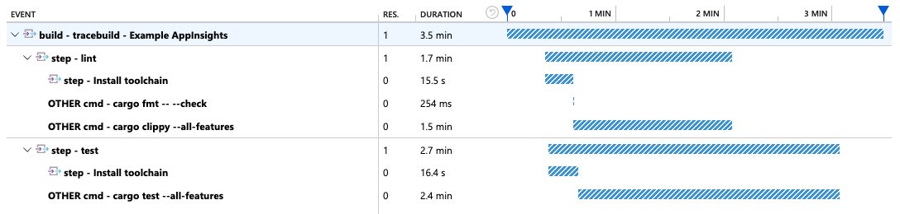

# Application Insights Example

This example shows a [GitHub Actions workflow](../../.github/workflows/example-app-insights.yml) that sends traces to Azure Application Insights.

- The workflow is instrumented with `tracebuild`, which sends trace to a local OpenTelemetry Collector
- The OpenTelemetry Collector is started as a service container
- To configure the collector, we have a [custom Docker image](./Dockerfile), which contains a [collector configuration](./config.yaml) that sends traces to Application Insights.

